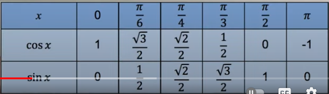
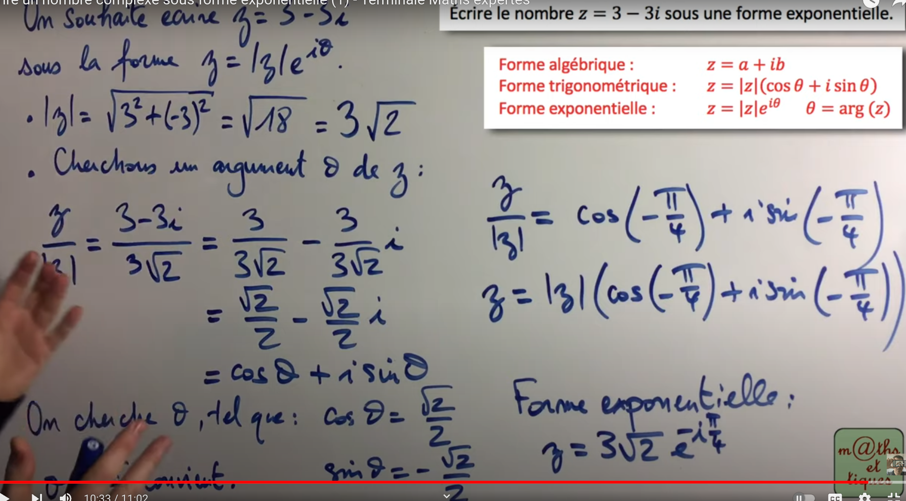
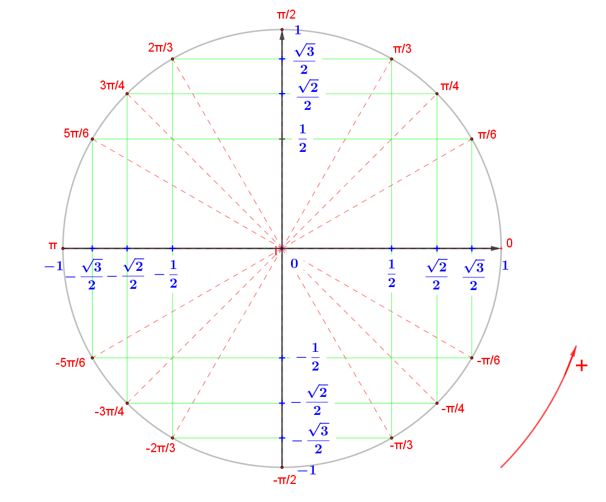

Translation d'un vecteur:

z' = z + v = x + iy + a + ib = x + a + i(y + b)

Transforme d'un point d'affixe z par la rotation de centre O(origin) et
d'angle 0:

z' = z * e^i0 = z * (cos0 + isin0)

Transforme d'un point d'affixe z par la rotation de centre C d'affixe zc et
d'angle 0:

La formule dit, soit:

R une rotation telle que:

z(OMEGA) = a' + ib', angle 0 = x

alors l'image de A zA= a + ib par la rotation R est B telle que:

zB - z(OMEGA) = e^i0 * (zA - z(OMEGA))

zB = e^i0 * (zA - z(OMEGA)) + z(OMEGA)

Ce qu'on fait donc c'est on fait la difference entre notre coordonnees 
actuelle par rapport au centre, puis on multiple par e^i0 = cos0 * isin0
pour effectuer la rotation, puis on r'ajoute la difference pour revenir 
dans le plan d'origin 

Rotation d'angle θ:

z' = e^iθ * z

# Rapelle sur les complexe:

Forme algebrique: z = a + ib 
Forme trigonometrique: z = |z|(cos O+ isin O)
Forme exponentielle: z = |z|e^iO

avec |z| le module de = sqrt(a² + b²)
et O l'argument de z

Valeur de cos et sin: 

Exercice example:

Etape:

1) On calcule le module de z
2) On cherche l'argument O de z et calculant z/|z|
3) on trouve la forme cos(O) + isin(O) (mais peut etre on trouve pas directement le O comme vue dans la video)
4) On manipule l'angle pour trouver le bon O.
5) Sa marche car si on multiplie les deux coter par |z| on trouve la forme trigonometrique qui est presque la meme que l'exponentielle.

Cercle trigo:

Exerice 4.3)

A -u-> B, A se tranforme en B par la translation du vecteur u.

affixe = forme complex

on cherche donc l'affixe du point obtenue par la translation, donc l'affixe de B (ZB)

On sait que AB = u , donc ZAB = Zu , donc ZB - ZA = Zu , donc ZB = ZA + Zu.
